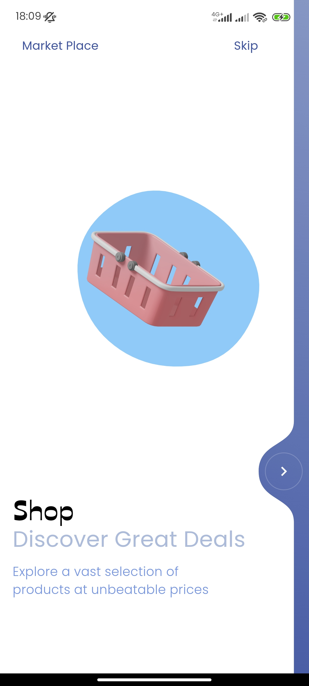
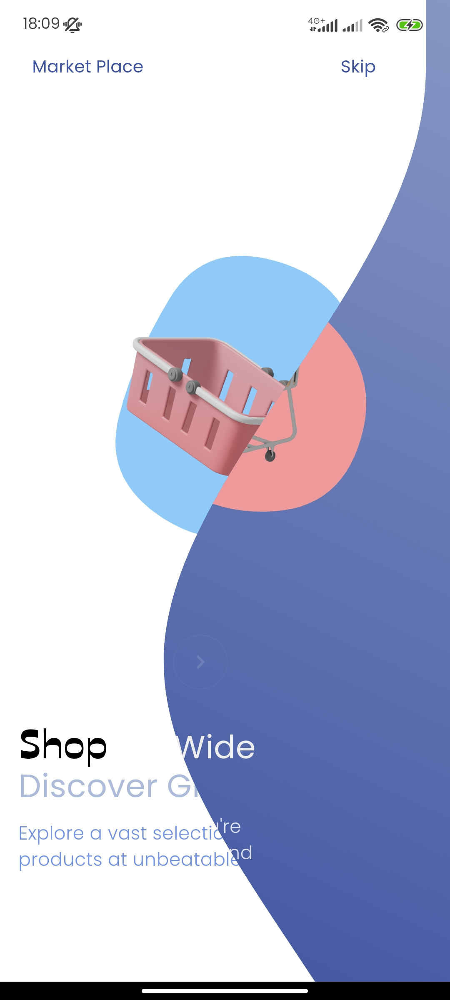
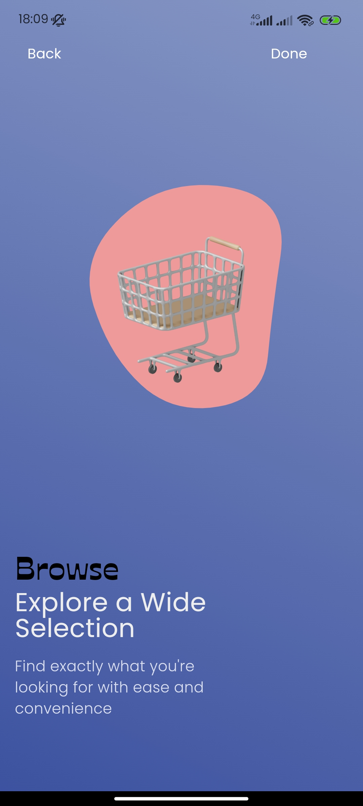

Flutter Liquid Swipe : A flutter package that lets you add liquid swipe onboarding to your app, this is a fork of luke pighetti's `https://x.com/luke_pighetti` implementation

## Screenshots




[GIF](screenshots/recording.gif)

To install this package, you can follow these steps:

## Installation

To install the `flutter_liquid_swipe` package, you can follow these steps:

1. Open your terminal or command prompt.
2. Run the following command to install the package:

   ```bash
   flutter pub add flutter_liquid_swipe
   ```

3. Once the package is installed, you can import it in your Flutter project:

   ```dart
   import package:flutter_liquid_swipe/liquid_swipe.dart;
   ```

4. You're now ready to use the `flutter_liquid_swipe` package in your Flutter project.

## Example

```
import 'package:flutter/material.dart';
import 'package:flutter_liquid_swipe/liquid_swipe.dart';

void main() {
  runApp(const LiquidSwipeApp());
}

class LiquidSwipeApp extends StatelessWidget {
  const LiquidSwipeApp({super.key});

  @override
  Widget build(BuildContext context) {
    return const MaterialApp(home: LiquidSwipeOnboarding());
  }
}

class LiquidSwipeOnboarding extends StatefulWidget {
  const LiquidSwipeOnboarding({super.key});

  @override
  State<LiquidSwipeOnboarding> createState() => _LiquidSwipeOnboardingState();
}

class _LiquidSwipeOnboardingState extends State<LiquidSwipeOnboarding> {
  final _key = GlobalKey<LiquidSwipeState>();

  LiquidSwipeState? get liquidSwipeController => _key.currentState;

  @override
  Widget build(BuildContext context) {
    return Scaffold(
        body: LiquidSwipe(key: _key, children: [
      LiquidSwipeCard(
          onTapName: () {},
          onSkip: () {},
          name: "Transcribe",
          action: "Skip",
          title: "SpeakEasy",
          subtitle: "Empowering Communication ",
          body: "Revolutionize the way you interact with the world ",
          buttonColor: Colors.black,
          titleStyle: TextStyle(
            fontSize: 20,
            color: Colors.grey.shade700,
          ),
          subtitleStyle: TextStyle(
            fontSize: 23,
            color: Colors.grey.shade900,
          ),
          bodyStyle: TextStyle(
            fontSize: 18,
            color: Colors.green.shade400,
          ),
          gradient: const LinearGradient(
            colors: [Colors.white, Colors.white],
            begin: Alignment.topLeft,
            end: Alignment.bottomRight,
          ),
          child: ClipRRect(
              borderRadius: BorderRadius.circular(10),
              child: Image.network("https://picsum.photos/300/200"))),
      LiquidSwipeCard(
          onTapName: () => liquidSwipeController?.previous(),
          onSkip: () {},
          name: "Back",
          action: "Done",
          title: "Cutting Edge Technology",
          subtitle: "With an Effortless Experience",
          body:
              "Our innovative speech-to-text solution offers precise transcription",
          buttonColor: Colors.white,
          titleStyle: const TextStyle(
            fontSize: 20,
            color: Colors.black,
          ),
          subtitleStyle: TextStyle(
            fontSize: 23,
            color: Colors.grey.shade400,
          ),
          bodyStyle: TextStyle(
            fontSize: 18,
            color: Colors.white.withOpacity(0.8),
          ),
          gradient: const LinearGradient(
            colors: [Colors.grey, Colors.green],
            begin: Alignment.topRight,
            end: Alignment.bottomLeft,
          ),
          child: ClipRRect(
              borderRadius: BorderRadius.circular(10),
              child: Image.network("https://picsum.photos/350/200"))),
    ]));
  }
}

```